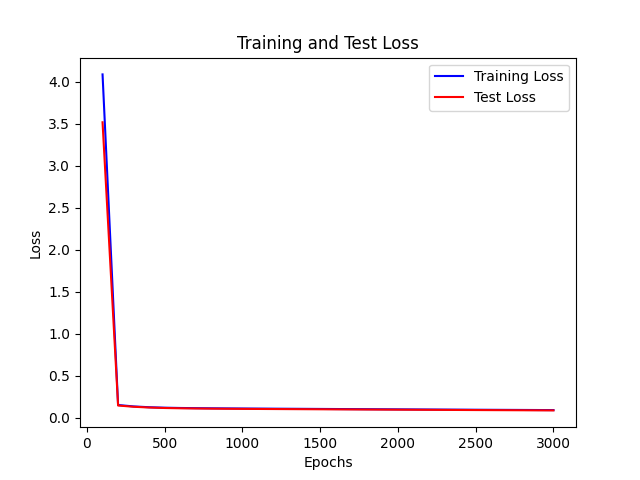
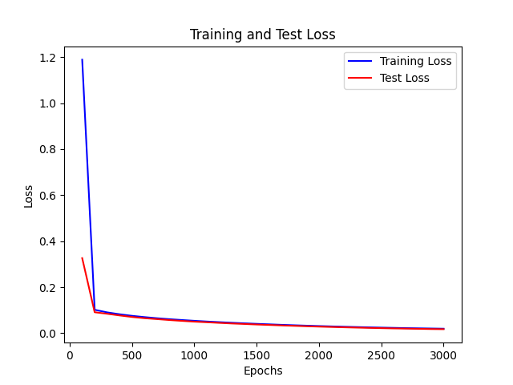
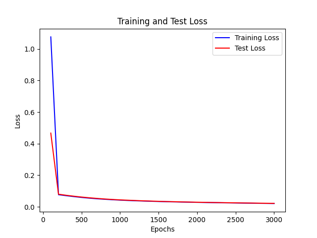

## Task 1

### 代码基本架构
- layer. py ： 代表的是神经网络的层，包含了该层**线性变化**和**非线性变化（可以设置为没有）**
- network. py ： 根据输入的参数构建的神经网络，包含backward forward方法
- sin
  - 文件夹都是数据
  - train_network_sin.py : 训练神经网络的程序
  - sin_data_model.py : 数据加载器
  - experiencescript. py : 实验脚本代码
  - trained_network.py ： 加载训练好的模型
- img
  - 文件夹都是数据
  - dataloader. py 
  - imgdataset. py  以上为模仿pytorch 的dataset 和dataloader写的数据集处理机制
  - train_network_img.py : 训练神经网络的程序
  - experiencescript. py : 实验脚本代码
  - trained_network=.py ： 加载训练好的模型

### 实验
#### 拟合 Sin
##### 学习率对网络的影响
* **基于 单层 32unit sigmoid激活函数 实验**
* **上图为lr为0.001 下图为 0.01 的情况**
可见 对于sigmoid函数而言
lr太小的话，在部分epoch之后，loss会开始慢速下降，导致训练缓慢，所以需要较大的lr

| 图像 |
| ---- | 
||
||
##### 正则项对网络的影响
* 下面的两个网络在相同初始化情况下进行迭代
* 可见 正则项会惩罚过大的梯度，导致下降较慢，同时会防止过拟合

| 网络             | L1误差  |图像
| ---------------- | -------------------- |---|
| 正则项系数为0 |  Epoch 2900, Loss: 0.0208701047369986||
| 正则项系数为0.01  | Epoch 2900, Loss: 0.022429724348479462 ||

##### 网络层数对网络的影响
* 实验：对两个不同网络同时进行十次测试 得到结果 取平均
* 可见单层网络收敛速度较快
* 双层网络更容易在不改变学习率的情况下不收敛

|网络 |3000epoch后的L1误差|
| -------------- | ------------------ | 
|sigmoid 单层网络 | 0.014551067166471124 |
|sigmoid双层网络  | 0.02297293823671869  |

##### 单层网络的神经元个数对网络的影响
* 实验：对两个不同单层网络同时进行十次测试 得到结果 取平均
* 可见在拟合任务上 单层情况下 越多的神经元数量会使得拟合的更快 且更准确
* 由于是拟合问题 所以神经元过多导致的过拟合问题就不会显现

| 网络             | 3000epoch后的L1误差    |
| ---------------- | -------------------- |
| 32个神经元 | 0.014551067166471124 |
| 128个神经元  | 0.006307620398259217  |

#### 图像分类
**实验都采取早停策略**
**此处都使用relu做激活函数，所以当神经元数量增加或减少时，学习率需要调整**
##### 学习率对网络的影响
**1024 单层网络Relu**
* 高的学习率任意使得网络在不断震荡难以收敛，甚至可能过快的将部分参数变为0，减缓参数的更新速率
* 更新学习率使得网络能够探索更优的解
**数据取自结束时或者早停时的最优周期 都来自同一个周期**

| 网络        | 30epoch内的loss |30epoch内的testacc |30epoch内的trainacc|
| ----------- | -------------------- |-------|------|
|lr = 0.0001  | 2.0469597488991536 |  0.431924882629108      | 0.9442922374429225|
|lr = 0.001   | 2.498936780690056 |  0.08333333333333333      |0.13333333333333303|
|lr = 0.001 会更新学习率 | 1.699310402647249 |0.4671361502347418 | 0.8841704718417047|

##### 正则项对网络的影响
* 与sin相同

##### 网络层数对网络的影响
* 实验：对两个不同网络同时进行测试 得到结果
* 可见单层网络收敛速度较快
* 双层网络更容易不收敛
* 此处引入早停的技术
  * 单层网络在30epoch内 未调整学习率 任意过早的早停
  * 双层网络则是在震荡
* 说明复杂任务中，**更需要较为合适的参数**
  
| 网络             | 30epoch中的交叉熵误差  |
| ---------------- | -------------------- |
| relu 1024单层网络 | 1.9417962233475392 |
| relu 1024-512 双层网络  | 2.504519644209117  |

##### 单层网络的神经元个数对网络的影响
* 过多易过拟合，过少难拟合
* 1024个神经元较容易拟合，而512个神经元则容易发生很多意外情况，例如震荡不收敛，出现溢出等情况

### 对反向传播算法的理解

#### 初始化参数的影响
* 初始化参数，极大的影响了网络的拟合速度和可行性
  * 在使用relu时如果参数值过大，极容易发生溢出的情况，使得网络难以训练
  * 而合适的参数能够使得初始的位置比较好，可以快速拟合
#### 学习率的影响
* 学习率与网络结构以及激活函数都相关
  * 对网络结构，越大的网络，初始学习率越小
  * 对激活函数，relu激活函数所需的学习率较小，若太大易溢出；sigmoid需要的较大，太小的话参数更新速度慢
#### 正则项的影响
* 正则化是用来惩罚过大的参数变化的，避免参数直接转变到不好的状态，使得网络难以调整

### 结果

