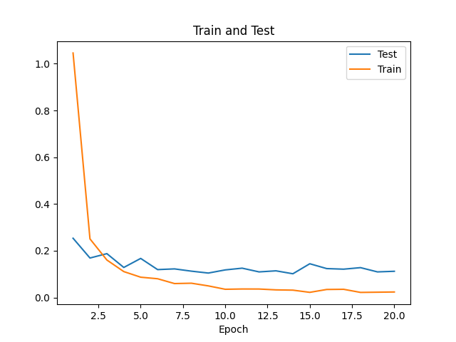

## Task2
### 代码基本结构
- img_dataset.py : 本地数据集处理 继承了pytorch 的Dataset类
- LeCNN .py ： 模仿LeNet写的CNN 修改了LeNet当中过时的部分
  - 采用两个卷积层  **卷积核数量、大小、step与Lenet相同**
  - 采用maxpool
  - 使用relu激活函数
  - 在全连接层和卷积层之后加入batchnorm
  - 在最后的全连接层之前加入dropout 增强网络的泛化能力
  - 使用Adam优化器
- trainfunc .py ：训练函数

### 对网络的改进
**参考AlexNet，AlexNet的任务相对较复杂，如果在我们的实验中直接引入AlexNet模型容易导致过拟合**
- dropout
  - 在网络中埋入多个分类器，使得网络不会过拟合
  - 同时增强网络的能力
- batchnor
  - 对每个batch进行normalization处理
  - 首先，可以加速训练并提高模型的收敛速度
  - 批量归一化引入了额外的参数（γ 和 β），可以作为正则化器，可以降低过拟合的风险
- Adam优化器
  - 自适应学习率优化算法，结合了动量方法和自适应学习率方法的优点

### 实验
- 网络结构
  - 更小的卷积窗口
  - 更多的卷积层
  - 更深的MLP层
- 下面为dropout 与batchnorm的实验
    - 由3，4与1，2的最优周期对比，可见 batchnorm**确实能够加速收敛**
    - 由1，2的对比可见，dropout提高了**模型的泛化能力**

|dropout | batchnorm                   | ACC图像                                         | LOSS 图像 |  最优epoch|
| --------|-------------- | -------------------------------------------- |-----------| --------|
|   F    |    F   |          | |epoch 18, loss 0.0587, train acc 0.983, test acc 0.959, time 3.4 sec|
|    T    |    F     |        ||epoch 20, loss 0.0538, train acc 0.983, test acc 0.972, time 2.9 sec|
|    F    |    T    |         ||epoch 17, loss 0.0094, train acc 0.997, test acc 0.974, time 2.9 sec|
|    T    |    T     |        ||epoch 18, loss 0.0217, train acc 0.993, test acc 0.975, time 2.9 sec|
### 对网络设计的理解

* **网络架构**：网络的架构包括网络层数、每一层的类型（全连接层、卷积层、池化层等）、每一层的大小和参数设置等。在设计网络架构时，要考虑到任务的复杂度、数据的特点和可用的计算资源等因素，以及避免出现过拟合或欠拟合等问题。

* **激活函数**：选择合适的激活函数对网络的性能影响很大。ReLU 激活函数通常是一个不错的选择，因为它可以缓解梯度消失问题，并且在实践中表现良好。但在某些情况下，如输出层的分类问题中，可能需要使用其他激活函数（如 Softmax）。

* **正则化和归一化**：正则化和归一化技术（如 Dropout、批量归一化等）可以帮助提高网络的泛化能力和训练速度。在网络设计中，要考虑是否需要使用这些技术，并且合适地将它们应用到网络中。

* **优化器和学习率调度器**：选择合适的优化器和学习率调度器对于训练过程的收敛速度和性能表现至关重要。在网络设计时，要考虑到网络的结构和任务的特点，并选择合适的优化器和学习率调度策略。

* **模型评估和调优**：在设计网络之后，需要进行模型评估和调优，以验证网络的性能并进行进一步的改进。这包括对模型进行训练、验证和测试，并根据实验结果进行调整和优化。

### 防止过拟合的方法
- 数据增强
  - 对汉字图片进行旋转，裁剪等操作，增大数据集，增加模型泛化能力
- dropout
  - 通过dropout来使得模型中存在多个分类器，在分类任务的表现更加出色
- 早停
  - 在训练函数中 加入patient，wait变量，当网络的结果不如之前最好的结果时，wait+1，到达patient则早停
  - 存储最优的结果