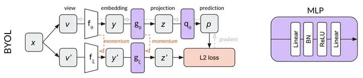
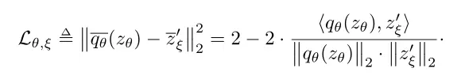

### 基于BYOL的预训练方法

#### 参考文献
**Grill, J.-B., Strub, F., Altché, F., Tallec, C., Richemond, P. H., Buchatskaya, E., ... Valko, M. (2020). Bootstrap your own latent: A new approach to self-supervised Learning. arXiv preprint arXiv:2006.07733.**
#### 数据准备
在这个基于BYOL的预训练方法中，我们首先需要准备大量的无标签图片数据，可以从ImageNet等较大的数据集中获取。这些无标签图片数据将用于自监督学习。

#### 超参设置
**以下为论文中的参数设置**
- 训练时长：1000个epoch，其中包括一个为期10个epoch的热身期（warm-up period）。
- 基础学习率（base learning rate）：设置为0.2，并且与批量大小按线性比例进行缩放（LearningRate = 0.2 × BatchSize/256）。
- 全局权重衰减（global weight decay）：设定为1.5 × 10^-6。
- LARS优化器：使用LARS优化器，并且在LARS适应和权重衰减中排除偏置项和批量归一化参数。
- 目标网络（target network）动量τ：起始值τbase为0.996，并且在训练过程中逐渐增加到1。具体地，根据当前的训练步数k和最大训练步数K设置τ，公式为τ = 1 - (1 - τbase) × (cos(πk/K) + 1)/2。
- 批量大小：4096

#### 模型结构
* BYOL模型由一个在线网络（online network）、一个目标网络（target network）和一个预测器（predictor）组成。
* 在线网络使用梯度回传，目标网络使用动量更新，它们都是深度卷积神经网络。
* 预测器是一个小型的MLP网络，结构如下图右侧，用于预测latent表示。

#### 训练目标函数
BYOL的训练目标是最小化预测器输出和目标网络的latent表示之间的差异。我们使用MSE来衡量两个向量之间的相似度，然后通过最小化差异来训练模型。
Lossfuc 如下

#### 评估
* * 微调后，适应下游任务(例如在不同数据集上的分类任务)
  * 把上述任务的结果与传统CNN、ViT在相同任务的结果进行比较
* 冻住主体的online network（不改变特征提取能力），只学习最后的全连接层，在下游任务上测试效果